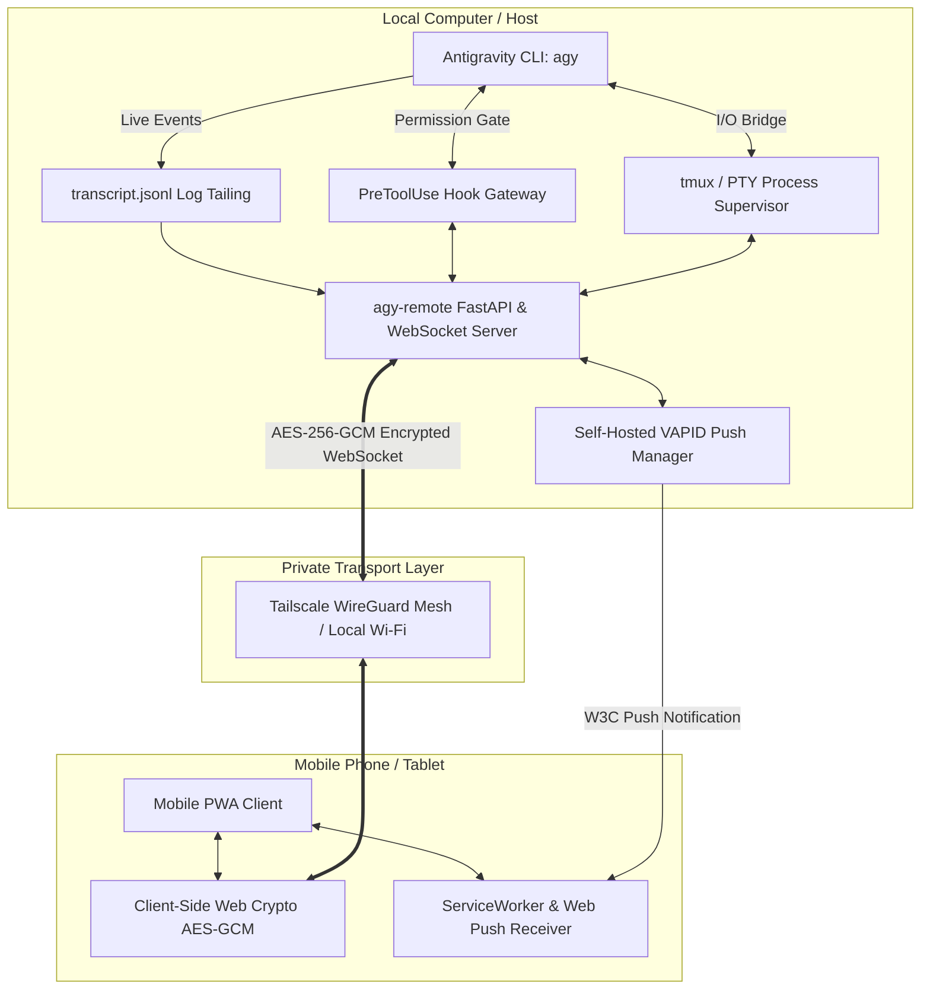

# 🚀 agy-remote

> **Self-Hosted, End-to-End Encrypted Mobile Web Remote & PWA for Google Antigravity CLI (`agy`)**  
> Access, monitor, and direct your locally running `agy` sessions from your phone over Tailscale or Local Wi-Fi — with zero cloud lock-in, client-side AES-256-GCM encryption, self-hosted Web Push alerts, persistent `tmux` execution, collapsible reasoning, one-tap tool approvals, and voice dictation.

---

## 📑 Table of Contents

- [Overview](#-overview)
- [Architecture](#-architecture)
- [Key Features](#-key-features)
- [Installation](#-installation)
- [Quickstart](#-quickstart)
  - [1. Persistent tmux Supervisor Mode (Recommended)](#1-persistent-tmux-supervisor-mode-recommended)
  - [2. Interactive PTY Mode](#2-interactive-pty-mode)
  - [3. Standalone Watcher Server Mode](#3-standalone-watcher-server-mode)
- [Mobile PWA Setup](#-mobile-pwa-setup)
- [Remote Tool Approvals (`hooks.json`)](#-remote-tool-approvals-hooksjson)
- [Web Push Notifications](#-web-push-notifications)
- [Security & Cryptography](#-security--cryptography)
- [CLI Reference](#-cli-reference)
- [Testing & Quality Assurance](#-testing--quality-assurance)
- [Troubleshooting & FAQ](#-troubleshooting--faq)
- [License](#-license)

---

## 🌟 Overview

When running autonomous coding agents like Antigravity CLI (`agy`), tasks frequently involve multi-step file edits, automated tests, and tool permission gates that take minutes to complete. Staying tethered to your desk or using awkward mobile SSH clients (where monospace terminals break text wrapping on narrow phone screens and soft keyboards make tool approvals painful) is suboptimal.

**`agy-remote`** bridges your local desktop session to a rich, responsive **Progressive Web App (PWA)** on your phone:
- **Zero Cloud Dependence**: 100% self-hosted on your machine.
- **End-to-End Encrypted**: AES-256-GCM encryption with cryptographic keys shared exclusively via URL hash fragments (`#key=...`).
- **First-Class Mobile UX**: Native mobile text wrapping, collapsible thinking accordions, syntax-highlighted diffs, voice dictation, and one-tap tool approval banners.

---

## 🏗️ Architecture



---

## ✨ Key Features

- 🔐 **End-to-End Encryption (E2EE)**: Full 256-bit AES-GCM envelope encryption. Keys are placed inside the browser's `#key=...` URL hash fragment, ensuring that network proxies or intermediate nodes never see the encryption key.
- 🔔 **Self-Hosted Web Push Notifications**: Native iOS & Android lock-screen push alerts via local VAPID keys whenever `agy` needs tool approval or completes a task.
- 🔄 **tmux Session Persistence**: Keep sessions running in the background across laptop sleep, screen locks, or closed terminals (`agy-remote run --tmux`).
- 📱 **Responsive PWA**: Installable directly to your iOS or Android Home Screen with safe-area padding and a sleek dark theme.
- 🛡️ **One-Tap Tool Permissions**: Forwards `PreToolUse` security prompts to your phone with haptic feedback to `[Allow]` or `[Deny]` commands.
- 📎 **Photo & Screenshot Upload**: Capture screenshots or camera photos directly from mobile into your workspace.
- 📝 **Visual Diff Viewer**: Interactive colored diffs for file edits.
- 🎙️ **Voice Dictation**: Dictate instructions into active prompts using mobile Web Speech recognition.
- 🔗 **Tailscale & LAN Auto-Discovery**: Auto-detects Tailscale IPv4 and renders an interactive **ASCII QR Code** in your terminal on launch.

---

## 📦 Installation

`agy-remote` is built with Python 3.13+ and managed with [`uv`](https://docs.astral.sh/uv/).

```bash
# Clone the repository
git clone https://github.com/user/agy-remote.git
cd agy-remote

# Install dependencies and sync virtual environment
uv sync
```

*(Optional)* Install `tmux` for background session persistence:
- **macOS**: `brew install tmux`
- **Ubuntu/Debian**: `sudo apt install tmux`

---

## 🚀 Quickstart

### 1. Persistent tmux Supervisor Mode (Recommended)

Spawns `agy` inside a background `tmux` session. You get standard terminal interaction on your Mac, while simultaneously monitoring and sending instructions from your phone:

```bash
uv run agy-remote run --tmux
```

*Scan the generated QR code on your terminal with your mobile phone camera to connect immediately.*

---

### 2. Interactive PTY Mode

If you prefer standard pseudoterminal multiplexing without `tmux`:

```bash
uv run agy-remote run
```

---

### 3. Standalone Watcher Server Mode

If you already have `agy` running in a separate terminal window:

```bash
uv run agy-remote serve
```

---

## 📱 Mobile PWA Setup

1. **Connect via Tailscale**: Ensure both your Mac and phone are on your private [Tailscale](https://tailscale.com/) network.
2. **Scan QR Code**: Point your phone camera at the QR code printed by `agy-remote`.
3. **Install as PWA**:
   - **iOS (Safari)**: Tap the **Share** button (`⎋`) ➔ Tap **Add to Home Screen** (`⊞`).
   - **Android (Chrome)**: Tap the **Menu** (`⋮`) ➔ Tap **Install App** / **Add to Home screen**.
4. **Enable Push Alerts**: Tap the bell icon (`🔔`) in the top navigation bar to grant lock-screen notification permissions.

---

## 🛡️ Remote Tool Approvals (`hooks.json`)

To enable one-tap `[Allow]` / `[Deny]` permission prompts on your phone when `agy` executes tools:

```bash
# Configure global Antigravity hooks (~/.gemini/config/hooks.json)
uv run agy-remote setup-hooks

# Or configure hooks specifically for the current project (.agents/hooks.json)
uv run agy-remote setup-hooks --project
```

When `agy` triggers a `PreToolUse` lifecycle event, `agy-remote` pauses execution, sends a push notification to your phone, and waits for your tap before proceeding.

---

## 🔔 Web Push Notifications

`agy-remote` features a fully self-contained **VAPID Web Push** server:
- VAPID keypairs are automatically generated and stored locally in `~/.gemini/antigravity-cli/vapid.json`.
- Zero third-party push notification SaaS accounts required.
- Test push notifications anytime from the command line:

```bash
uv run agy-remote push-test "Test alert from agy-remote"
```

---

## 🔒 Security & Cryptography

| Security Layer | Implementation Details |
| :--- | :--- |
| **Transport Encryption** | Tailscale WireGuard Mesh / HTTPS / WSS. |
| **Payload E2EE** | Client-side 256-bit **AES-GCM** using the browser Web Crypto API (`SubtleCrypto`). |
| **Zero-Knowledge Keying** | Encryption key is passed via URL hash (`#key=...`), which is never transmitted in HTTP headers. |
| **Authentication** | High-entropy session tokens verified with constant-time `secrets.compare_digest`. |
| **Path Traversal Defense** | Strict alphanumeric checks on `conversation_id` and directory containment verification. |
| **Upload Sanitization** | Image-only MIME/extension validation, filename base isolation, and a 25MB file size limit. |

---

## 📖 CLI Reference

### Commands

| Command | Description |
| :--- | :--- |
| `agy-remote run [args...]` | Launch `agy` inside supervisor with dual desktop & mobile sync. |
| `agy-remote run --tmux` | Launch `agy` inside a persistent `tmux` session (`agy-remote`). |
| `agy-remote serve` | Start standalone log watcher server. |
| `agy-remote qr` | Re-display pairing QR code and active network URLs. |
| `agy-remote setup-hooks` | Install Antigravity lifecycle hooks for remote tool approvals. |
| `agy-remote push-test [msg]` | Send a test Web Push notification to registered mobile devices. |

### Environment Variables

| Variable | Default | Description |
| :--- | :--- | :--- |
| `AGY_REMOTE_PORT` | `8765` | Server port. |
| `AGY_REMOTE_HOST` | `0.0.0.0` | Server bind host. |
| `AGY_REMOTE_TOKEN` | *Auto-generated* | Custom authentication token. |
| `AGY_REMOTE_NO_AUTH` | `0` | Set `1` to disable token authentication. |
| `AGY_REMOTE_NO_E2EE` | `0` | Set `1` to disable End-to-End Encryption. |
| `AGY_BRAIN_DIR` | `~/.gemini/antigravity-cli/brain` | Custom path to Antigravity brain data. |

---

## 🧪 Testing & Quality Assurance

Run the automated test suite and code quality checks:

```bash
# Run pytest test suite
uv run pytest

# Check code formatting and linting
uv run ruff format .
uv run ruff check .
```

---

## ❓ Troubleshooting & FAQ

**Q: Why does the QR code show `127.0.0.1` instead of Tailscale?**  
A: Ensure the Tailscale desktop client is running (`tailscale status`). `agy-remote` automatically prioritizes Tailscale IPv4 addresses when available.

**Q: Why are push notifications not arriving on iOS?**  
A: On iOS, Web Push requires saving the page as a PWA via **Share ➔ Add to Home Screen** in Safari (iOS 16.4+). Launch the app from your home screen and tap the bell icon to grant permissions.

**Q: Can I use `agy-remote` without `tmux`?**  
A: Yes! Standard `uv run agy-remote run` uses the built-in PTY supervisor.

---

## 📄 License

MIT License. Built for seamless agentic pair-programming workflows.
