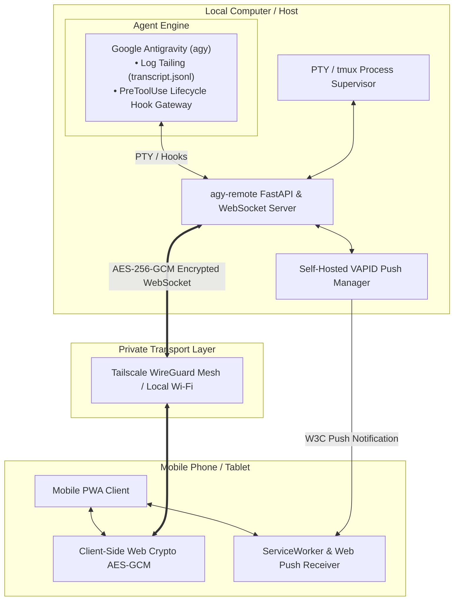

# 🚀 agy-remote

> **Self-Hosted, Encrypted Mobile Web Remote & PWA for Google Antigravity CLI (`agy`)**  
> Access, monitor, and direct your locally running `agy` sessions from your phone over Tailscale or Local Wi-Fi — with zero cloud lock-in, AES-256-GCM encrypted payloads, a live mirrored terminal view, self-hosted Web Push alerts, one-tap tool approvals, and voice dictation.

[](https://pypi.org/project/agy-remote/)    

---

## 📑 Table of Contents

- [Overview](#-overview)
- [Architecture & Backends](#-architecture--backends)
- [Key Features](#-key-features)
- [Installation](#-installation)
- [Quickstart: Antigravity (`agy`)](#-quickstart-antigravity-agy)
  - [1. PTY Supervisor Mode (Recommended)](#1-pty-supervisor-mode-recommended)
  - [2. tmux Persistence Mode](#2-tmux-persistence-mode)
  - [3. Standalone Watcher Server Mode](#3-standalone-watcher-server-mode)
  - [4. Two agy sessions at once](#4-two-agy-sessions-at-once)
- [Using opencode instead](#-using-opencode-instead)
- [Mobile PWA Setup](#-mobile-pwa-setup)
- [Remote Tool Approvals](#-remote-tool-approvals)
- [Terminal Key Controls](#-terminal-key-controls)
- [Web Push Notifications](#-web-push-notifications)
- [Security & Cryptography](#-security--cryptography)
- [CLI Reference](#-cli-reference)
- [Testing & Quality Assurance](#-testing--quality-assurance)
- [Troubleshooting & FAQ](#-troubleshooting--faq)
- [License](#-license)

---

## 🌟 Overview

When running an autonomous coding agent like Google Antigravity CLI (`agy`), tasks frequently involve multi-step file edits, automated test runs, and tool permission gates that take minutes to complete. Staying tethered to your desk or using awkward mobile SSH clients (where monospace terminals break text wrapping on narrow phone screens and soft keyboards make tool approvals painful) is suboptimal.

The workflow is inspired by [Claude Code](https://claude.com/claude-code) and its remote-control and mobile-approval experience — `agy-remote` brings that same "step away from the desk while the agent works" loop to **Google Antigravity CLI**, self-hosted and without a cloud relay. If you're coming from Claude Code, Gemini CLI, or another terminal coding agent, the concepts (transcript streaming, tool-permission gates, execution modes) map directly.

**`agy-remote`** bridges your local desktop agent session to a rich, responsive **Progressive Web App (PWA)** on your phone:
- **Built for a terminal agent**: `agy` has no server and no web UI of its own; this is what puts it on a phone.
- **Zero Cloud Dependence**: 100% self-hosted, and the PWA loads no third-party scripts — it works on an air-gapped tailnet.
- **Encrypted Payloads**: AES-256-GCM on every WebSocket frame with replay protection, keyed by a secret shared via the URL hash (`#key=...`). See [Security](#-security--cryptography) for what this does and does not protect.
- **First-Class Mobile UX**: Native mobile text wrapping, collapsible thinking accordions, colored diffs, voice dictation, and one-tap tool approval banners.

---

## 🏗️ Architecture & Backends

`agy-remote` decouples the mobile interface from the underlying agent via a unified backend adapter interface:



### Backend Mechanics

| Capability | Google Antigravity (`agy`) |
| :--- | :--- |
| **Transcript Source** | Local disk log tailing (`transcript.jsonl`) |
| **Tool Approvals** | Lifecycle hook gateway (`PreToolUse` via `hooks.json`) |
| **Hook Setup Needed** | Yes (`agy-remote setup-hooks`) |
| **Prompt Injection** | PTY / tmux keystroke injection |
| **Supervisor Launch** | `agy-remote run` |

The backend seam (`backends.py`) stays in place with one implementation: a manager
that knows about transcript files is the alternative, and adopting a session the
supervisor did not start plugs in here rather than threading conditionals through
the manager.

---

## ✨ Key Features

- 🔐 **Payload Encryption**: Every WebSocket frame in both directions is sealed with 256-bit AES-GCM, with replay protection. The key travels in the `#key=...` URL hash, which browsers never send to the server, and is scrubbed from the address bar on load. See [Security](#-security--cryptography) for the precise threat model.
- 🔔 **Self-Hosted Web Push Notifications**: Native iOS & Android lock-screen push alerts via local VAPID keys whenever `agy` needs tool approval or completes a task.
- 🔄 **tmux Session Persistence**: Keep sessions running in the background across laptop sleep, screen locks, or closed terminals (`agy-remote run --tmux`).
- 📱 **Responsive PWA**: Installable directly to your iOS or Android Home Screen with safe-area padding and a sleek dark theme.
- 🛡️ **One-Tap Tool Permissions**: Forwards tool permission prompts (shell commands, file modifications, git pushes) to your phone with haptic feedback to `[Allow]` or `[Deny]`.
- 📎 **Photo & Screenshot Upload**: Capture screenshots or camera photos directly from mobile into your workspace.
- 📝 **Visual Diff Viewer**: Interactive colored diffs for file edits, rendered locally.
- 🎙️ **Voice Dictation**: Dictate instructions into active prompts using mobile Web Speech recognition.
- 🖥️ **Live Terminal Mirror**: The supervised terminal is emulated *server-side* and streamed as plain text — see pickers, confirmations, and status bar from the phone, with no third-party scripts shipped to the browser.
- ⌨️ **Remote Key Control**: Cycle execution modes (`Shift+Tab`), close panels (`Esc`), and drive selection lists — an allowlisted named-key channel, never raw bytes.
- 🧹 **Readable Transcripts**: Tool calls collapse to one line (`run_command(git status)`), bulk output to a line count, and agent internal scaffolding is labelled instead of masquerading as conversation.
- ⏳ **Expiring Pairings**: The pairing URL is a durable secret, so it expires after 30 days by default; `--rotate-token` revokes every paired device immediately.
- 🔗 **Tailscale & LAN Auto-Discovery**: Auto-detects Tailscale IPv4, obtains a real HTTPS certificate from Tailscale, and renders an interactive **ASCII QR Code** in your terminal on launch.

---

## 📦 Installation

`agy-remote` is published on [PyPI](https://pypi.org/project/agy-remote/) and requires Python 3.13+.

### Option 1: Run on-demand with `uvx` (Fastest, zero install)

Run directly from any project folder without a permanent installation:

```bash
uvx agy-remote run
```

### Option 2: Install globally with `uv tool` (Recommended)

Install `agy-remote` globally so you can use the CLI anywhere on your system:

```bash
uv tool install agy-remote
```

Once installed, run it directly:
```bash
agy-remote run
```

To update to the latest release in the future:
```bash
uv tool upgrade agy-remote
```

### Option 3: From Source (Development)

```bash
# Clone the repository
git clone https://github.com/ollisulopuisto/agy-remote.git
cd agy-remote

# Install dependencies and sync virtual environment
uv sync
```

*(Optional)* Install `tmux` for background session persistence:
- **macOS**: `brew install tmux`
- **Ubuntu/Debian**: `sudo apt install tmux`

---

## 🚀 Quickstart: Antigravity (`agy`)

### 1. PTY Supervisor Mode (Recommended)

Runs `agy` under a pseudoterminal: you get the normal `agy` TUI in your terminal, while the phone can read the transcript, send prompts and keystrokes, approve tools, and view the mirrored terminal screen:

```bash
uvx agy-remote run
# or if installed globally:
agy-remote run
```

*Scan the QR code with your phone camera to connect. The pairing survives restarts — the token and encryption key are minted once and reused.*

---

### 2. tmux Persistence Mode

Keeps the session alive across laptop sleep, closed terminals, and SSH drops by running `agy` inside a `tmux` session named `agy-remote`. Prompt injection and key control work; the live terminal mirror is PTY-mode only:

```bash
agy-remote run --tmux
```

The QR pauses on screen until you press a key — attaching to tmux replaces the
whole terminal, so the code would otherwise vanish behind agy before you can
scan it. `agy-remote qr` re-displays it at any time.

---

### 3. Standalone Watcher Server Mode

If you already have `agy` running in a separate terminal. **Read-only plus approvals**: the phone sees the transcript and can approve tools, but there is no supervised session to type into:

```bash
agy-remote serve
```

---

### 4. Two agy sessions at once

Run a second, fully independent instance on another port. Each server supervises
its own `agy`, gets its own tmux session name, and hands its phone its own URL:

```bash
agy-remote run                 # session A -> :8765, tmux "agy-remote"
agy-remote run -p 8766         # session B -> :8766, tmux "agy-remote-8766"
agy-remote qr --port 8766      # pairing QR for session B
```

Each session's tool approvals go to its own phone: the server exports
`AGY_REMOTE_URL` into the `agy` it launches, and that `agy`'s PreToolUse hook
posts there. Pair the phone with both URLs and switch between them like any two
web apps — both share the host's token and encryption key, so there is no second
pairing secret to manage.

---

## 🔀 Using opencode instead

`agy-remote` used to front [opencode](https://github.com/sst/opencode) as a second
backend. It no longer does, because opencode does not need it: `opencode serve`
already hosts a mobile-tuned web app at `/`, and `opencode web` is the same thing
with a browser opened for you.

What that leaves you to solve is transport, and Tailscale does it in one command:

```bash
opencode serve --port 4096                 # stays on 127.0.0.1, its default
tailscale serve --bg --https 8443 4096     # tailnet HTTPS, real certificate
```

Then open `https://<your-machine>.<tailnet>.ts.net:8443/` on your phone. There is a
ready-made shell helper in [`contrib/opencode-tailscale.zsh`](contrib/opencode-tailscale.zsh)
that starts both, waits for the server, and prints the URL with a scannable QR code.

> [!WARNING]
> Do not give opencode `--hostname 0.0.0.0`. It prints *"OPENCODE_SERVER_PASSWORD is
> not set; server is unsecured"* for a reason — anything that reaches the port can
> drive an agent with shell access. Keep it on loopback, let `tailscale serve` be the
> only door, and set `OPENCODE_SERVER_PASSWORD` as well. Never `tailscale funnel` it.

What you give up versus this PWA: lock-screen push when a tool needs approval, and a
single paired app for both agents.

---

## 📱 Mobile PWA Setup

1. **Connect via Tailscale**: Ensure both your Mac and phone are on your private [Tailscale](https://tailscale.com/) network.
2. **Scan QR Code**: Point your phone camera at the QR code printed by `agy-remote`.
3. **Install as PWA**:
   - **iOS (Safari)**: Tap the **Share** button (`⎋`) ➔ Tap **Add to Home Screen** (`⊞`).
   - **Android (Chrome)**: Tap the **Menu** (`⋮`) ➔ Tap **Install App** / **Add to Home screen**.
4. **Enable Push Alerts**: Tap the bell icon (`🔔`) in the top navigation bar to grant lock-screen notification permissions.

---

## 🛡️ Remote Tool Approvals

When an agent needs permission to execute bash commands, edit files, or invoke external APIs, `agy-remote` pauses execution, sends a Web Push notification to your phone lock screen, and presents interactive `[Allow]` / `[Deny]` action buttons.

### For Google Antigravity (`agy`):
Install the Antigravity PreToolUse lifecycle hooks:

```bash
# Configure global Antigravity hooks (~/.gemini/config/hooks.json)
agy-remote setup-hooks

# Or configure hooks specifically for the current project (.agents/hooks.json)
agy-remote setup-hooks --project
```


---

## ⌨️ Terminal Key Controls

A prompt from the phone is text plus Enter, which cannot express the keys agy's
TUI actually needs: `Shift+Tab` cycles the execution mode (`default` →
`accept-edits` → `plan`), `Esc` closes a panel or halts a stream, and the arrow
keys drive the selection lists behind `/model`, `/permissions` and `/resume`.

The PWA sends those as named keys, over the same sealed WebSocket as prompts, or
via `POST /api/key` with `{"key": "shift_tab"}`. Only names from the allowlist in
`keys.py` are accepted — never raw bytes, since the pty is wired to a live agent
session. Both supervisors implement it: the PTY path writes the escape sequence,
the tmux path calls `tmux send-keys`.

| Key | Name | Use |
| :--- | :--- | :--- |
| `Shift+Tab` | `shift_tab` | Cycle execution mode |
| `Esc` | `escape` | Close panel / halt stream |
| `↑` `↓` `←` `→` | `up` `down` `left` `right` | Move through a selection list |
| `Enter` | `enter` | Confirm the highlighted choice |
| `Tab` | `tab` | Confirm slash-command autocomplete |
| `y` / `n` | `yes` / `no` | Answer a tool confirmation |
| `Ctrl+C` | `interrupt` | Interrupt |
| `PgUp` `PgDn` | `page_up` `page_down` | Scroll a panel |
| `Backspace` | `backspace` | Delete a character |

**Seeing the screen.** The PWA renders `transcript.jsonl`, which holds the
conversation and nothing else — everything agy draws transiently (the `/model`
picker, `/permissions`, autocomplete, the execution mode in the status bar)
exists only on the terminal. The supervisor now feeds its pty output through a
terminal emulator *on the server* (`screen.py`, `pyte`) and ships the resulting
grid of plain text: tap **Screen** to see it, and the execution mode appears as
a badge beside the title. Running the emulator server-side keeps the PWA free of
third-party scripts, so it still works on an air-gapped tailnet.

The mirror matches the pty, which inherits the size of the desktop terminal that
launched it. One pty has one size, so the phone sees the desktop's geometry —
scroll horizontally rather than expecting a reflow. In watcher mode there is no
supervised session and no screen.

**What the phone still cannot see.** Anything agy draws as a transient panel — the `/model` picker,
the mode indicator in the status bar, autocomplete — never reaches the
transcript, so keys aimed at those panels are sent blind. Slash commands that
produce conversation output work normally; ones that open a panel need the
desktop terminal in view.

---

## 🔔 Web Push Notifications

`agy-remote` features a fully self-contained **VAPID Web Push** server:
- VAPID keypairs are automatically generated and stored locally in `~/.gemini/antigravity-cli/vapid.json`.
- Zero third-party push notification SaaS accounts required.
- Test push notifications anytime from the command line:

```bash
uv run agy-remote push-test "Test alert from agy-remote"
```

---

## 🔒 Security & Cryptography

### Threat model in one line

The token and encryption key are minted once and kept in
`~/.gemini/antigravity-cli/agy-remote-credentials.json` (owner-only), so the URL
saved on your phone keeps working across restarts and `agy-remote run` needs no
arguments. `--rotate-token` issues new ones and revokes every paired device. Pairings also
expire on their own after **30 days** (`AGY_REMOTE_CREDENTIAL_TTL_DAYS`; `0`
disables expiry): a pairing URL is a durable secret, and a leaked QR screenshot
or a lost phone should not stay a way in forever. After expiry the next launch
prints a fresh QR to re-scan.

**Anyone who can reach this server and holds the token can run arbitrary code on your machine** — prompts are injected straight into your live `agy` session. Treat the token like an SSH key.

### What protects what

| Layer | Implementation | Covers |
| :--- | :--- | :--- |
| **Transport** | Tailscale WireGuard mesh (recommended), or plain HTTP on LAN | Phone ↔ tailnet peer. **Not** the last hop behind a subnet router. |
| **Payload encryption** | AES-256-GCM over **every** WebSocket frame, both directions | Transcripts, tool args, diffs, prompts, approvals — even on a cleartext hop |
| **Replay defence** | Timestamp bound as GCM AAD + nonce cache, ±300 s window | Captured `send_prompt` / `approve_tool` frames cannot be re-injected |
| **Downgrade defence** | Unsealed frames are rejected outright when E2EE is on | Token holder without the key cannot drive the agent |
| **Authentication** | High-entropy token, constant-time `secrets.compare_digest` on *every* entry point (REST, WebSocket, hook) | Unauthorized access |
| **Bind safety** | `--no-auth` is refused on any non-loopback bind | Unauthenticated RCE |
| **Browser** | Strict CSP, zero third-party origins, escape-first Markdown renderer | Prompt-injected XSS stealing the key from `localStorage` |
| **Path traversal** | Strict `conversation_id` charset + containment check | Reading files outside the brain dir |
| **Uploads** | Extension allowlist **and** magic-byte sniffing, 25 MB cap, `0600` | Active-content and disguised-payload drops |
| **Secrets at rest** | `vapid.json` and the runtime state file are `0600` | Local key theft |

### Honest naming

The key is generated by the server and shared with the browser through the URL hash, so this is **pre-shared-key payload encryption between your phone and your Mac** — not zero-knowledge end-to-end encryption. The server is one of the two endpoints and necessarily sees plaintext. What it buys you is real: the payload stays sealed across any hop the transport does not protect.

### Where the encryption actually earns its keep

With a **Tailscale subnet router** (e.g. OpenWrt) rather than Tailscale on the Mac itself:

```
Phone  ──WireGuard──▶  OpenWrt (subnet router)  ──plain LAN──▶  Mac
        encrypted                                cleartext
```

The tunnel terminates at the router. That last LAN hop is unencrypted HTTP, so the AES-GCM payload layer is the only thing protecting your transcripts there. **Keep E2EE enabled in this topology.** Running `tailscaled` on the Mac itself removes the gap entirely and is the stronger setup.

### Operational guidance

- ✅ Tailscale (on the Mac, ideally) with auth enabled — the intended configuration.
- ⚠️ LAN-only: works, but anyone on the Wi-Fi can reach the port. Keep auth **and** E2EE on.
- ❌ Never `AGY_REMOTE_NO_AUTH=1` on a routable bind — the server refuses to start.
- ❌ Never expose the port to the public internet or via port-forwarding.

## 📖 CLI Reference

### Commands

| Command | Description |
| :--- | :--- |
| `agy-remote run [args...]` | Launch `agy` under a PTY with dual desktop & mobile control (recommended). |
| `agy-remote run --tmux` | Launch `agy` inside a persistent `tmux` session (`agy-remote`). |
| `agy-remote serve` | Start standalone log watcher server. |
| `agy-remote qr` | Re-display pairing QR code and active network URLs. |
| `agy-remote qr --port N` | Pairing QR for the instance on port `N` (a second instance does not own the shared runtime state). |
| `agy-remote run --rotate-token` | Issue a new token and encryption key, revoking every paired phone. |
| `agy-remote setup-hooks` | Install Antigravity lifecycle hooks for remote tool approvals (`agy` only). |
| `agy-remote push-test [msg]` | Send a test Web Push notification to registered mobile devices. |

### CLI Options

| Flag | Commands | Description |
| :--- | :--- | :--- |
| `--qr-timeout <seconds>` | `run` | Time in seconds to display QR code countdown before attaching TUI (default: `30`s; `0` to attach immediately). |
| `--tmux` | `run` | Run agent inside a persistent `tmux` session. |
| `--port`, `-p <port>` | All server commands | Web server port (default: `8765`). |
| `--host`, `-h <host>` | All server commands | Web server host bind address (default: `0.0.0.0`). |
| `--token`, `-t <token>` | All server commands | Custom authentication token. |
| `--rotate-token` | `run`, `serve` | Mint fresh auth token and encryption key, invalidating existing mobile pairings. |
| `--no-auth` | All server commands | Disable token authentication (**refused on non-loopback binds**). |
| `--no-e2ee` | All server commands | Disable payload encryption. |
| `--tls / --no-tls` | All server commands | Force enable or disable Tailscale HTTPS certificate. |

### Environment Variables

| Variable | Default | Description |
| :--- | :--- | :--- |
| `AGY_REMOTE_AGENT` | `agy` | Name of the agent this server fronts, as shown in the PWA header. |
| `AGY_REMOTE_PORT` | `8765` | Server port. |
| `AGY_REMOTE_URL` | *Set by `run`* | Which server a supervised `agy`'s PreToolUse hook posts to. Exported into the child; set it by hand only to point a hand-started `agy` at a specific instance. |
| `AGY_REMOTE_HOST` | `0.0.0.0` | Server bind host. |
| `AGY_REMOTE_TOKEN` | *Stored* | Override the stored authentication token. |
| `AGY_REMOTE_NO_AUTH` | `0` | Set `1` to disable token authentication. **Refused unless bound to loopback.** |
| `AGY_REMOTE_NO_E2EE` | `0` | Set `1` to disable payload encryption. Leave enabled unless debugging. |
| `AGY_BRAIN_DIR` | `~/.gemini/antigravity-cli/brain` | Custom path to Antigravity brain data. |
| `AGY_REMOTE_E2EE_KEY` | *Stored* | Override the stored base64 256-bit payload key. |
| `AGY_REMOTE_CREDENTIAL_TTL_DAYS` | `30` | Pairing credential lifespan in days (`0` to disable expiry). |

---

## 🧪 Testing & Quality Assurance

Run the automated test suite and code quality checks:

```bash
# Run pytest test suite
uv run pytest

# Check code formatting and linting
uv run ruff format .
uv run ruff check .

# Run the PWA's formatting tests (node's built-in runner, no dependencies)
node --test "tests/js/*.test.mjs"
```

---

## ❓ Troubleshooting & FAQ

**Q: What happened to opencode support?**  
A: It was removed — opencode ships its own mobile-tuned web UI (`opencode serve` hosts it at `/`), so fronting it here duplicated work someone else maintains. See [Using opencode instead](#-using-opencode-instead) for the two-command Tailscale setup and the helper script.

**Q: Can I pass arguments to `agy` when launching `agy-remote run`?**  
A: Yes. Anything after `--` is forwarded directly to `agy`:
```bash
agy-remote run -- --resume <session-id>
```

**Q: Why does the QR code show a countdown before attaching?**  
A: A fullscreen TUI like `agy` immediately redraws the terminal when attaching, which would clear the pairing QR code before you could scan it. The countdown (`--qr-timeout`, default 30s) gives you time to scan or press any key to attach instantly.

**Q: Why does the QR code show my LAN IP instead of Tailscale?**  
A: The Tailscale *daemon* must be running on this machine, not just installed — check `tailscale status`. `agy-remote` prioritizes a Tailscale IPv4 when one exists, and falls back to the LAN address otherwise.

**Q: My router runs Tailscale. Does the Mac need it too?**  
A: Tailscale is per-device, not a router feature. A router acting as a **subnet router** can advertise the Mac's subnet, and your phone (which must itself be a tailnet node) will then reach the Mac — but the tunnel ends at the router, leaving the final LAN hop in cleartext. Keep payload encryption enabled in that setup, or install Tailscale on the Mac for an end-to-end tunnel.

**Q: Do I need Tailscale at all?**  
A: No. If the phone and Mac share a Wi-Fi network, use the LAN URL. Keep auth and E2EE on, since anyone on that network can reach the port.

**Q: Why are push notifications not arriving on iOS?**  
A: On iOS, Web Push requires saving the page as a PWA via **Share ➔ Add to Home Screen** in Safari (iOS 16.4+). Launch the app from your home screen and tap the bell icon to grant permissions.

**Q: Can I use `agy-remote` without `tmux`?**  
A: Yes. Plain `agy-remote run` uses the built-in PTY supervisor; `--tmux` is opt-in.

---

## 📄 License

[MIT](LICENSE). Built for seamless agentic pair-programming workflows — use it, fork it, ship it.
