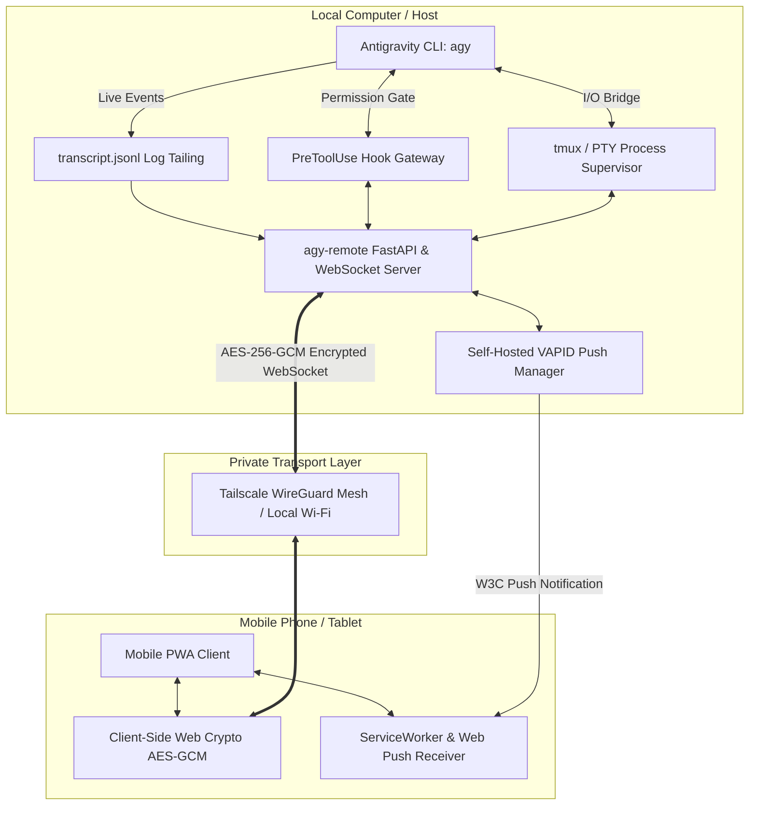

# 🚀 agy-remote

> **Self-Hosted, Encrypted Mobile Web Remote & PWA for Google Antigravity CLI (`agy`)**  
> Access, monitor, and direct your locally running `agy` sessions from your phone over Tailscale or Local Wi-Fi — with zero cloud lock-in, AES-256-GCM encrypted payloads, self-hosted Web Push alerts, persistent `tmux` execution, collapsible reasoning, one-tap tool approvals, and voice dictation.

---

## 📑 Table of Contents

- [Overview](#-overview)
- [Architecture](#-architecture)
- [Key Features](#-key-features)
- [Installation](#-installation)
- [Quickstart](#-quickstart)
  - [1. Persistent tmux Supervisor Mode (Recommended)](#1-persistent-tmux-supervisor-mode-recommended)
  - [2. Interactive PTY Mode](#2-interactive-pty-mode)
  - [3. Standalone Watcher Server Mode](#3-standalone-watcher-server-mode)
- [Mobile PWA Setup](#-mobile-pwa-setup)
- [Remote Tool Approvals (`hooks.json`)](#-remote-tool-approvals-hooksjson)
- [Web Push Notifications](#-web-push-notifications)
- [Security & Cryptography](#-security--cryptography)
- [CLI Reference](#-cli-reference)
- [Testing & Quality Assurance](#-testing--quality-assurance)
- [Troubleshooting & FAQ](#-troubleshooting--faq)
- [License](#-license)

---

## 🌟 Overview

When running autonomous coding agents like Antigravity CLI (`agy`), tasks frequently involve multi-step file edits, automated tests, and tool permission gates that take minutes to complete. Staying tethered to your desk or using awkward mobile SSH clients (where monospace terminals break text wrapping on narrow phone screens and soft keyboards make tool approvals painful) is suboptimal.

**`agy-remote`** bridges your local desktop session to a rich, responsive **Progressive Web App (PWA)** on your phone:
- **Zero Cloud Dependence**: 100% self-hosted, and the PWA loads no third-party scripts — it works on an air-gapped tailnet.
- **Encrypted Payloads**: AES-256-GCM on every WebSocket frame with replay protection, keyed by a secret shared via the URL hash (`#key=...`). See [Security](#-security--cryptography) for what this does and does not protect.
- **First-Class Mobile UX**: Native mobile text wrapping, collapsible thinking accordions, colored diffs, voice dictation, and one-tap tool approval banners.

---

## 🏗️ Architecture



---

## ✨ Key Features

- 🔐 **Payload Encryption**: Every WebSocket frame in both directions is sealed with 256-bit AES-GCM, with replay protection. The key travels in the `#key=...` URL hash, which browsers never send to the server, and is scrubbed from the address bar on load. See [Security](#-security--cryptography) for the precise threat model.
- 🔔 **Self-Hosted Web Push Notifications**: Native iOS & Android lock-screen push alerts via local VAPID keys whenever `agy` needs tool approval or completes a task.
- 🔄 **tmux Session Persistence**: Keep sessions running in the background across laptop sleep, screen locks, or closed terminals (`agy-remote run --tmux`).
- 📱 **Responsive PWA**: Installable directly to your iOS or Android Home Screen with safe-area padding and a sleek dark theme.
- 🛡️ **One-Tap Tool Permissions**: Forwards `PreToolUse` security prompts to your phone with haptic feedback to `[Allow]` or `[Deny]` commands.
- 📎 **Photo & Screenshot Upload**: Capture screenshots or camera photos directly from mobile into your workspace.
- 📝 **Visual Diff Viewer**: Interactive colored diffs for file edits, rendered locally.
- 🎙️ **Voice Dictation**: Dictate instructions into active prompts using mobile Web Speech recognition.
- 🔗 **Tailscale & LAN Auto-Discovery**: Auto-detects Tailscale IPv4 and renders an interactive **ASCII QR Code** in your terminal on launch.

---

## 📦 Installation

`agy-remote` is built with Python 3.13+ and managed with [`uv`](https://docs.astral.sh/uv/).

```bash
# Clone the repository
git clone https://github.com/user/agy-remote.git
cd agy-remote

# Install dependencies and sync virtual environment
uv sync
```

*(Optional)* Install `tmux` for background session persistence:
- **macOS**: `brew install tmux`
- **Ubuntu/Debian**: `sudo apt install tmux`

---

## 🚀 Quickstart

### 1. Persistent tmux Supervisor Mode (Recommended)

Spawns `agy` inside a background `tmux` session. You get standard terminal interaction on your Mac, while simultaneously monitoring and sending instructions from your phone:

```bash
uv run agy-remote run --tmux
```

*Scan the generated QR code on your terminal with your mobile phone camera to connect immediately.*

---

### 2. Interactive PTY Mode

If you prefer standard pseudoterminal multiplexing without `tmux`:

```bash
uv run agy-remote run
```

---

### 3. Standalone Watcher Server Mode

If you already have `agy` running in a separate terminal window:

```bash
uv run agy-remote serve
```

---

## 📱 Mobile PWA Setup

1. **Connect via Tailscale**: Ensure both your Mac and phone are on your private [Tailscale](https://tailscale.com/) network.
2. **Scan QR Code**: Point your phone camera at the QR code printed by `agy-remote`.
3. **Install as PWA**:
   - **iOS (Safari)**: Tap the **Share** button (`⎋`) ➔ Tap **Add to Home Screen** (`⊞`).
   - **Android (Chrome)**: Tap the **Menu** (`⋮`) ➔ Tap **Install App** / **Add to Home screen**.
4. **Enable Push Alerts**: Tap the bell icon (`🔔`) in the top navigation bar to grant lock-screen notification permissions.

---

## 🛡️ Remote Tool Approvals (`hooks.json`)

To enable one-tap `[Allow]` / `[Deny]` permission prompts on your phone when `agy` executes tools:

```bash
# Configure global Antigravity hooks (~/.gemini/config/hooks.json)
uv run agy-remote setup-hooks

# Or configure hooks specifically for the current project (.agents/hooks.json)
uv run agy-remote setup-hooks --project
```

When `agy` triggers a `PreToolUse` lifecycle event, `agy-remote` pauses execution, sends a push notification to your phone, and waits for your tap before proceeding.

---

## ⌨️ Terminal Key Controls

A prompt from the phone is text plus Enter, which cannot express the keys agy's
TUI actually needs: `Shift+Tab` cycles the execution mode (`default` →
`accept-edits` → `plan`), `Esc` closes a panel or halts a stream, and the arrow
keys drive the selection lists behind `/model`, `/permissions` and `/resume`.

The PWA sends those as named keys, over the same sealed WebSocket as prompts, or
via `POST /api/key` with `{"key": "shift_tab"}`. Only names from the allowlist in
`keys.py` are accepted — never raw bytes, since the pty is wired to a live agent
session. Both supervisors implement it: the PTY path writes the escape sequence,
the tmux path calls `tmux send-keys`.

| Key | Name | Use |
| :--- | :--- | :--- |
| `Shift+Tab` | `shift_tab` | Cycle execution mode |
| `Esc` | `escape` | Close panel / halt stream |
| `↑` `↓` `←` `→` | `up` `down` `left` `right` | Move through a selection list |
| `Enter` | `enter` | Confirm the highlighted choice |
| `Tab` | `tab` | Confirm slash-command autocomplete |
| `y` / `n` | `yes` / `no` | Answer a tool confirmation |
| `Ctrl+C` | `interrupt` | Interrupt |
| `PgUp` `PgDn` | `page_up` `page_down` | Scroll a panel |
| `Backspace` | `backspace` | Delete a character |

**Seeing the screen.** The PWA renders `transcript.jsonl`, which holds the
conversation and nothing else — everything agy draws transiently (the `/model`
picker, `/permissions`, autocomplete, the execution mode in the status bar)
exists only on the terminal. The supervisor now feeds its pty output through a
terminal emulator *on the server* (`screen.py`, `pyte`) and ships the resulting
grid of plain text: tap **Screen** to see it, and the execution mode appears as
a badge beside the title. Running the emulator server-side keeps the PWA free of
third-party scripts, so it still works on an air-gapped tailnet.

The mirror matches the pty, which inherits the size of the desktop terminal that
launched it. One pty has one size, so the phone sees the desktop's geometry —
scroll horizontally rather than expecting a reflow. In watcher mode there is no
supervised session and no screen.

**What the phone still cannot see.** Anything agy draws as a transient panel — the `/model` picker,
the mode indicator in the status bar, autocomplete — never reaches the
transcript, so keys aimed at those panels are sent blind. Slash commands that
produce conversation output work normally; ones that open a panel need the
desktop terminal in view.

---

## 🔔 Web Push Notifications

`agy-remote` features a fully self-contained **VAPID Web Push** server:
- VAPID keypairs are automatically generated and stored locally in `~/.gemini/antigravity-cli/vapid.json`.
- Zero third-party push notification SaaS accounts required.
- Test push notifications anytime from the command line:

```bash
uv run agy-remote push-test "Test alert from agy-remote"
```

---

## 🔒 Security & Cryptography

### Threat model in one line

The token and encryption key are minted once and kept in
`~/.gemini/antigravity-cli/agy-remote-credentials.json` (owner-only), so the URL
saved on your phone keeps working across restarts and `agy-remote run` needs no
arguments. `--rotate-token` issues new ones and revokes every paired device.

**Anyone who can reach this server and holds the token can run arbitrary code on your machine** — prompts are injected straight into your live `agy` session. Treat the token like an SSH key.

### What protects what

| Layer | Implementation | Covers |
| :--- | :--- | :--- |
| **Transport** | Tailscale WireGuard mesh (recommended), or plain HTTP on LAN | Phone ↔ tailnet peer. **Not** the last hop behind a subnet router. |
| **Payload encryption** | AES-256-GCM over **every** WebSocket frame, both directions | Transcripts, tool args, diffs, prompts, approvals — even on a cleartext hop |
| **Replay defence** | Timestamp bound as GCM AAD + nonce cache, ±300 s window | Captured `send_prompt` / `approve_tool` frames cannot be re-injected |
| **Downgrade defence** | Unsealed frames are rejected outright when E2EE is on | Token holder without the key cannot drive the agent |
| **Authentication** | High-entropy token, constant-time `secrets.compare_digest` on *every* entry point (REST, WebSocket, hook) | Unauthorized access |
| **Bind safety** | `--no-auth` is refused on any non-loopback bind | Unauthenticated RCE |
| **Browser** | Strict CSP, zero third-party origins, escape-first Markdown renderer | Prompt-injected XSS stealing the key from `localStorage` |
| **Path traversal** | Strict `conversation_id` charset + containment check | Reading files outside the brain dir |
| **Uploads** | Extension allowlist **and** magic-byte sniffing, 25 MB cap, `0600` | Active-content and disguised-payload drops |
| **Secrets at rest** | `vapid.json` and the runtime state file are `0600` | Local key theft |

### Honest naming

The key is generated by the server and shared with the browser through the URL hash, so this is **pre-shared-key payload encryption between your phone and your Mac** — not zero-knowledge end-to-end encryption. The server is one of the two endpoints and necessarily sees plaintext. What it buys you is real: the payload stays sealed across any hop the transport does not protect.

### Where the encryption actually earns its keep

With a **Tailscale subnet router** (e.g. OpenWrt) rather than Tailscale on the Mac itself:

```
Phone  ──WireGuard──▶  OpenWrt (subnet router)  ──plain LAN──▶  Mac
        encrypted                                cleartext
```

The tunnel terminates at the router. That last LAN hop is unencrypted HTTP, so the AES-GCM payload layer is the only thing protecting your transcripts there. **Keep E2EE enabled in this topology.** Running `tailscaled` on the Mac itself removes the gap entirely and is the stronger setup.

### Operational guidance

- ✅ Tailscale (on the Mac, ideally) with auth enabled — the intended configuration.
- ⚠️ LAN-only: works, but anyone on the Wi-Fi can reach the port. Keep auth **and** E2EE on.
- ❌ Never `AGY_REMOTE_NO_AUTH=1` on a routable bind — the server refuses to start.
- ❌ Never expose the port to the public internet or via port-forwarding.

## 📖 CLI Reference

### Commands

| Command | Description |
| :--- | :--- |
| `agy-remote run [args...]` | Launch `agy` inside supervisor with dual desktop & mobile sync. |
| `agy-remote run --tmux` | Launch `agy` inside a persistent `tmux` session (`agy-remote`). |
| `agy-remote serve` | Start standalone log watcher server. |
| `agy-remote qr` | Re-display pairing QR code and active network URLs. |
| `agy-remote run --rotate-token` | Issue a new token and encryption key, revoking every paired phone. |
| `agy-remote setup-hooks` | Install Antigravity lifecycle hooks for remote tool approvals. |
| `agy-remote push-test [msg]` | Send a test Web Push notification to registered mobile devices. |

### Environment Variables

| Variable | Default | Description |
| :--- | :--- | :--- |
| `AGY_REMOTE_PORT` | `8765` | Server port. |
| `AGY_REMOTE_HOST` | `0.0.0.0` | Server bind host. |
| `AGY_REMOTE_TOKEN` | *Stored* | Override the stored authentication token. |
| `AGY_REMOTE_NO_AUTH` | `0` | Set `1` to disable token authentication. **Refused unless bound to loopback.** |
| `AGY_REMOTE_NO_E2EE` | `0` | Set `1` to disable payload encryption. Leave enabled unless debugging. |
| `AGY_BRAIN_DIR` | `~/.gemini/antigravity-cli/brain` | Custom path to Antigravity brain data. |
| `AGY_REMOTE_E2EE_KEY` | *Stored* | Override the stored base64 256-bit payload key. |

---

## 🧪 Testing & Quality Assurance

Run the automated test suite and code quality checks:

```bash
# Run pytest test suite
uv run pytest

# Check code formatting and linting
uv run ruff format .
uv run ruff check .
```

---

## ❓ Troubleshooting & FAQ

**Q: Why does the QR code show my LAN IP instead of Tailscale?**  
A: The Tailscale *daemon* must be running on this machine, not just installed — check `tailscale status`. `agy-remote` prioritizes a Tailscale IPv4 when one exists, and falls back to the LAN address otherwise.

**Q: My router runs Tailscale. Does the Mac need it too?**  
A: Tailscale is per-device, not a router feature. A router acting as a **subnet router** can advertise the Mac's subnet, and your phone (which must itself be a tailnet node) will then reach the Mac — but the tunnel ends at the router, leaving the final LAN hop in cleartext. Keep payload encryption enabled in that setup, or install Tailscale on the Mac for an end-to-end tunnel.

**Q: Do I need Tailscale at all?**  
A: No. If the phone and Mac share a Wi-Fi network, use the LAN URL. Keep auth and E2EE on, since anyone on that network can reach the port.

**Q: Why are push notifications not arriving on iOS?**  
A: On iOS, Web Push requires saving the page as a PWA via **Share ➔ Add to Home Screen** in Safari (iOS 16.4+). Launch the app from your home screen and tap the bell icon to grant permissions.

**Q: Can I use `agy-remote` without `tmux`?**  
A: Yes! Standard `uv run agy-remote run` uses the built-in PTY supervisor.

---

## 📄 License

MIT License. Built for seamless agentic pair-programming workflows.
